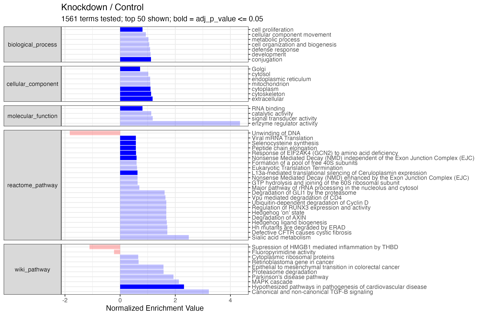

```{r, echo = FALSE}
knitr::opts_chunk$set(collapse = TRUE, comment = "#>")
set.seed(1041)
options(dplyr.print_max = 10)
```

# Automating data analysis

In Tidyproteomics both the _expression()_ and _enrichment()_ analyses can be automated to 
run through a list of sample pairs, running the analysis first and then generating the 
associated plots and tables.

Both the _expression()_ and _enrichment()_ functions have been updated to now include
the __.pairs__ option which accepts a list of multiple two sample pairs which you 
can define outside the functions: 
```{r, eval=FALSE}
pairs <- list(
  c('experiment_A', 'control'),
  c('experiment_B', 'control'),
  c('experiment_C', 'control'),
  c('experiment_B', 'experiment_A'),
  c('experiment_C', 'experiment_A')
)
```

The _enrichment()_ function has changed the _.term_ variable to _.terms_ to also 
accept either a single term or multiple terms defined as a string vector: 
```{r, eval=FALSE}

terms <- "biological_process"

# -- or --  

terms <- c("biological_process",
           "cellular_component",
           "molecular_function",
           "wiki_pathway",
           "reactome_pathway")
```

The two new functions _analyze_expressions()_ and _analyze_enrichments()_ will then 
iterate through the analyses and save out plots and tables. The final plot for 
_analyze_enrichments()_ will generate a concatenated single bar plot for all terms
tested - individual bubble plots for each term can be created separately. Note,
the _analyze_enrichments()_ function takes the additional parameter __significance_max__ 
to provide a cutoff for significance highlighting. 
```{r, warning=FALSE, message=FALSE}
library(tidyverse)
library(tidyproteomics)
```

```{r, warning=FALSE}
pairs <- list(
  c('knockdown', 'control'))

terms <- c("biological_process",
           "cellular_component",
           "molecular_function",
           "wiki_pathway",
           "reactome_pathway")

hela_proteins <- hela_proteins %>%
  # perform the calculations
  expression(.pairs = pairs) %>%
  enrichment(.pairs = pairs, .terms = terms, .cpu_cores = 4, .method = 'wilcoxon') %>%
  # run the analysis that saves out plots and tables
  analyze_expressions(labels_column = 'gene_name') %>%
  analyze_enrichments(significance_max = 0.05)


```

Each plot and table are save in the local directory and labeled accordingly.


```{r}
"./table_proteins_enrichment_knockdown-control.csv" %>% read.csv()
```



